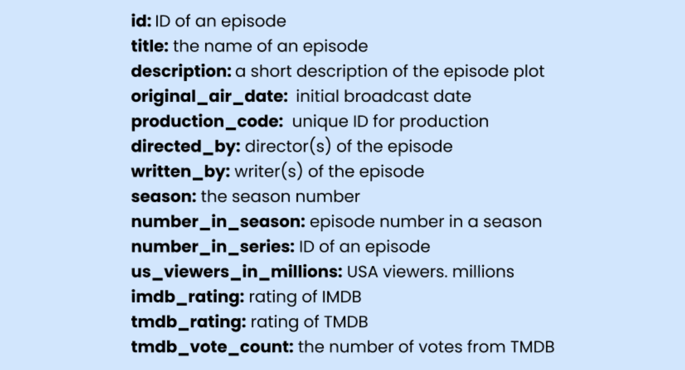
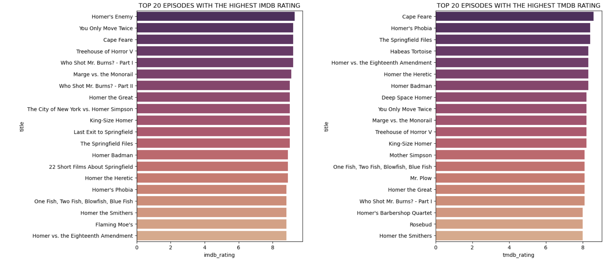
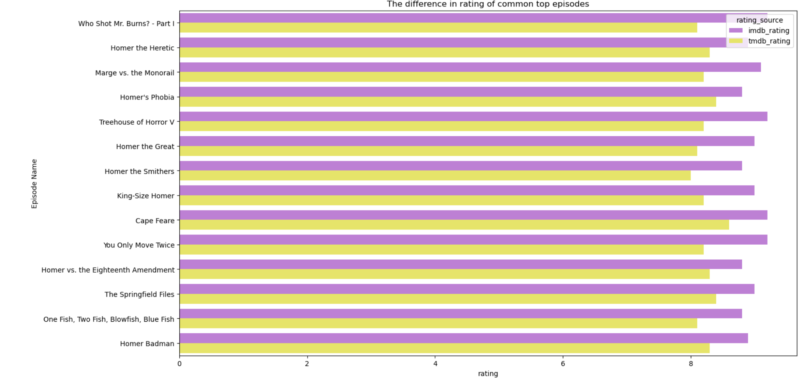
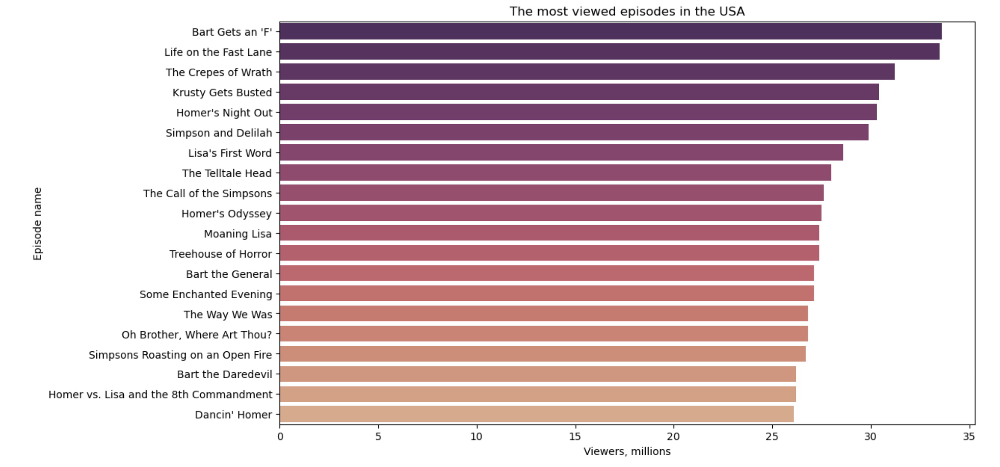
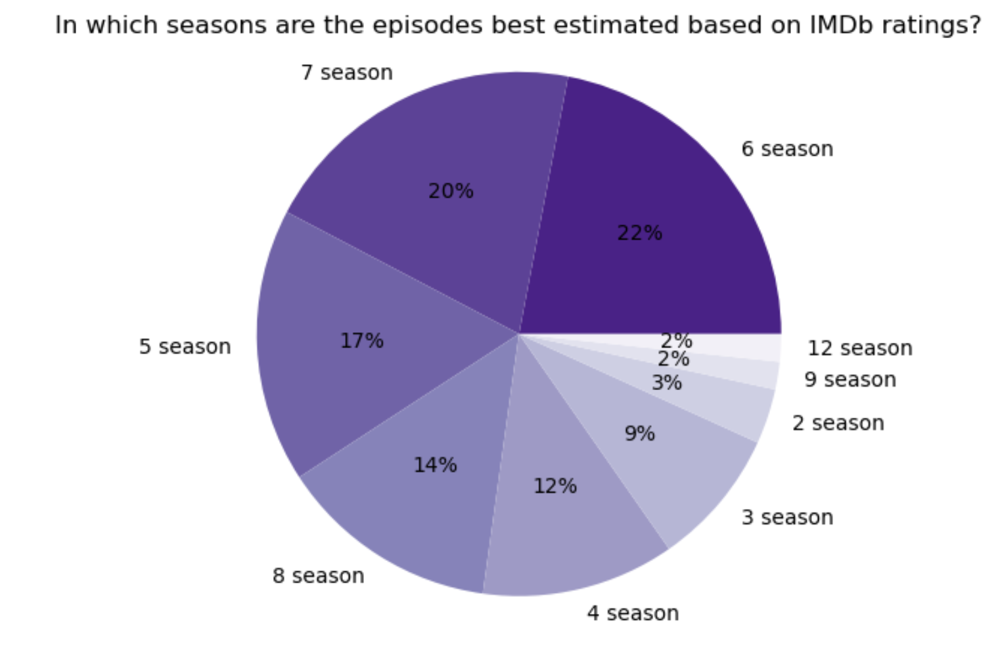
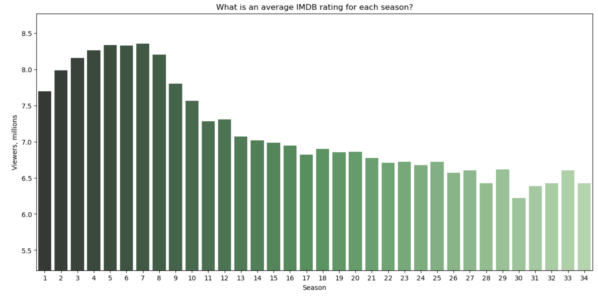
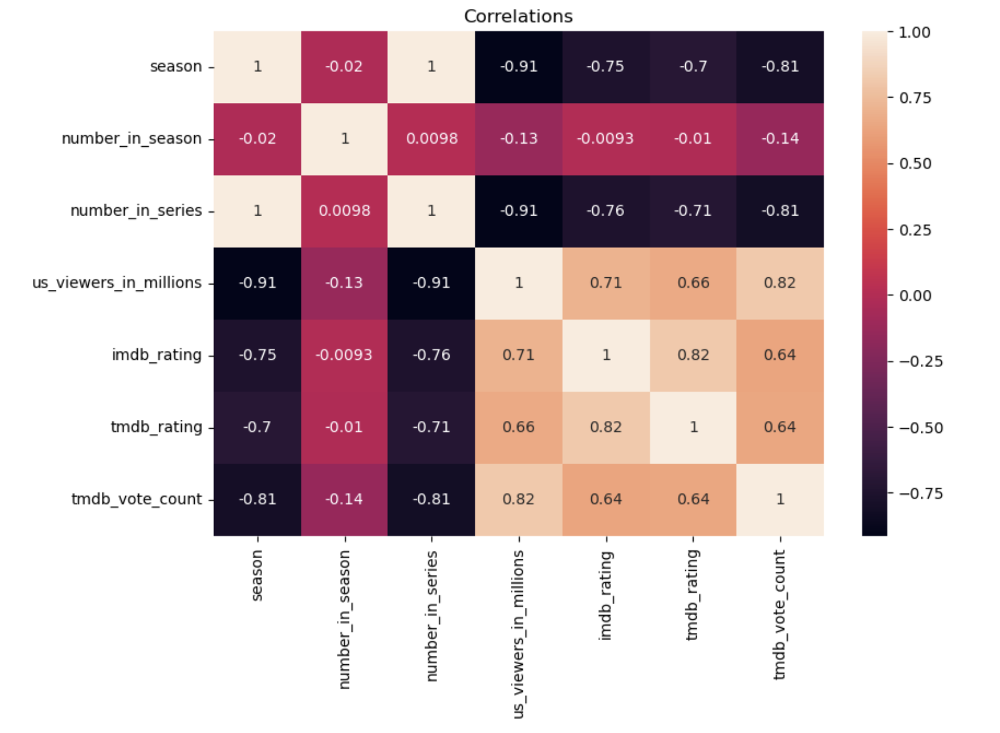
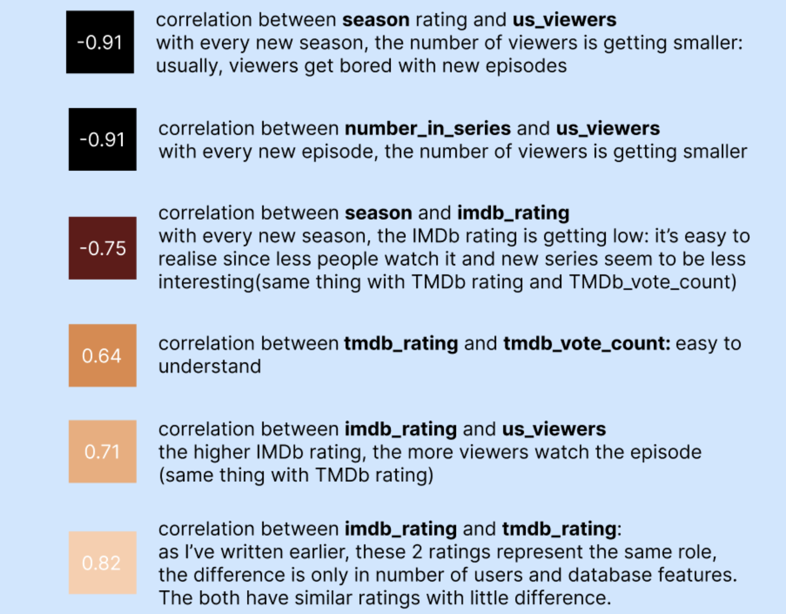
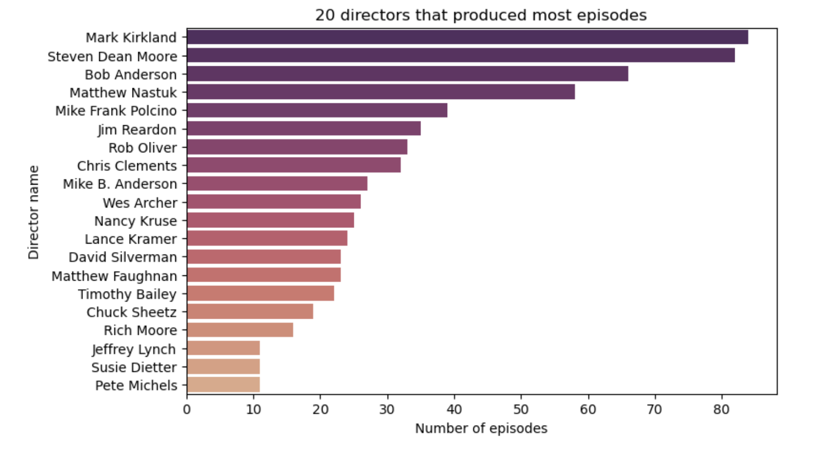

Conducting an exploratory data analysis in a dataset of all Simpsons episodes. Building several visualizations and getting statistical insights.
# The Simpsons dataset: Exploratory data analysis
This project presents an exploratory data analysis of The Simpsons dataset, that is one of the most iconic and my favourite television series.

## Dataset overview
The dataset consists of 14 columns and 747 recordings, having 43% of features are categorical and the rest is numerical.

## Exploratory data analysis
### The most viewed episodes from all episodes

IMDb rating is a bit higher than TMDb in all common top episodes. As known, IMDb platform has more users and its database is bigger than TMDb.

### The most viewed episodes in the USA

Interesting fact is that favourite episodes of USA viewers are not found in general favourite episodes of all viewers.

### Seasons with top episodes

### How many viewers in each season

### Average IMDB rating for each season

### Correlation heatmap

### Top directors of cool episodes

## Conlusions
In this project The Simpsons dataset was explored by cleaning the data and analyzing key variables so that there were created visualizations to better understand the structure of the show. There was explored what seasons and exact episodes viewers like the most, average IMDB and TMDB ratings and the difference between them. It shows that IMDB ratings are higher. Basic visualizations made it easier to spot patterns and compare different aspects of the data.

